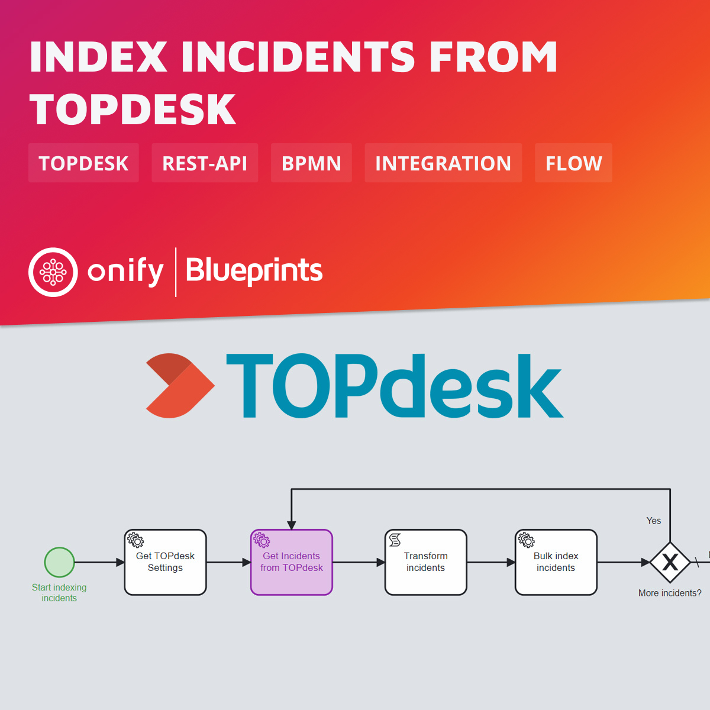

# Onify Blueprint: Index incidents from TOPdesk

[TOPdesk](https://www.topdesk.com/) TOPdesk is a leading case/ticket management system for customer communication, management of workflows and for asset management. TOPdesk has approximately 10 million active SAAS users worldwide. "Better support, happy customers"...

In this Blueprint we index all incidents from TOPdesk using REST-API integration.

## Requirements

* [Onify Hub](https://github.com/onify/install)
* [Camunda Modeler](https://camunda.com/download/modeler/)
* [TOPdesk](https://www.topdesk.com/)

## Included

* 1 x Flow

## Setup

Add the following settings.

|Key|Name|Value|Type|Tag|Role|
|---|----|-----|----|---|----|
|topdesk_api_url|TOPdesk API url|`<TOPDESK URL>/tas/api`|string|topdesk|admin|
|topdesk_token|TOPdesk API token|`********`|string|topdesk|admin|

> Note: Creating settings via admin interface add a trailing `_` in key. This is required for flow to work.

## Test

1. Open the BPMN diagram in Camunda Modeler.
2. Update script in Transform incidents tasks (optional)
3. Deploy the BPMN diagram (click `Deploy current diagram` and follow the steps).
4. Run it (click `Start current diagram`).

## Support

* Community/forum: https://support.onify.co/discuss
* Documentation: https://support.onify.co/docs
* Support and SLA: https://support.onify.co/docs/get-support

## License

This project is licensed under the MIT License - see the [LICENSE](LICENSE) file for details.

## Contributors

Thanks [Tony Aronsson](https://github.com/Aronsson84) and [Joakim Jensen](https://github.com/oceansmoving) @ [Zitac](https://github.com/zitacconsulting) for the support.